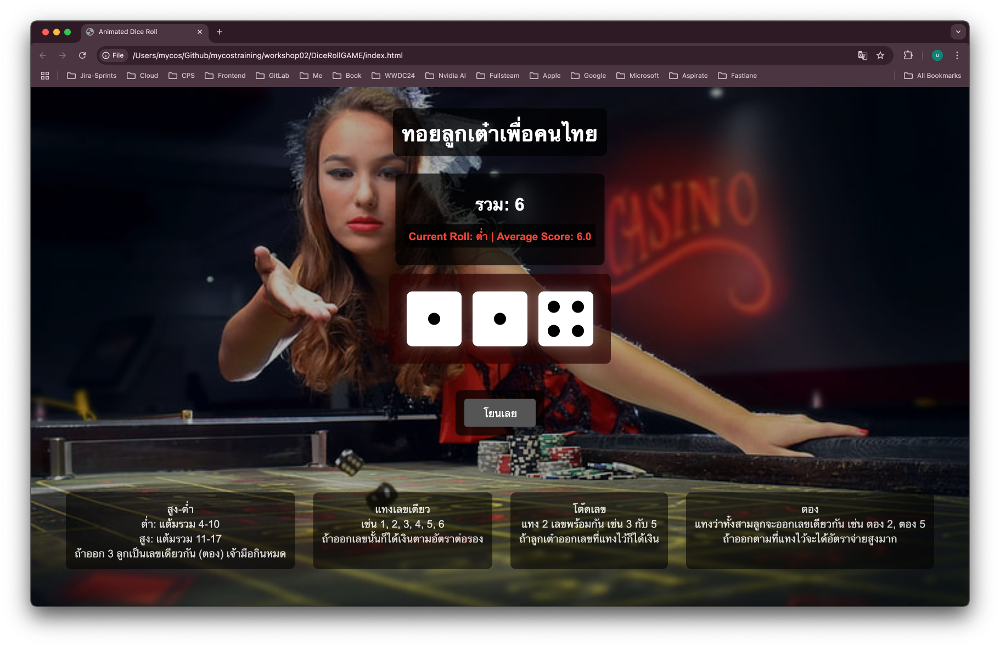

# JavaScript in Action

This is a solution to the [JavaScript in Action by Khem]

## Screenshot



## Built With

- HTML
- CSS
- JavaScript

## Getting Started

To get a local copy up and running, follow these steps:

### Installation

1. Clone the repository:
   ```sh
   git clone https://github.com/mycosgke/mycostraining.git